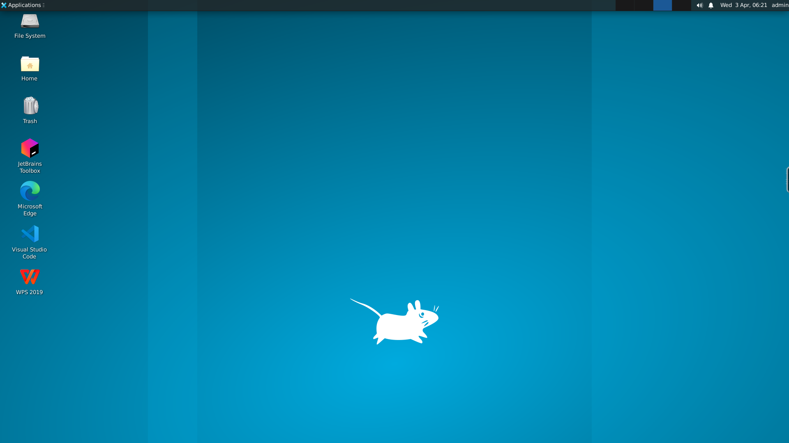
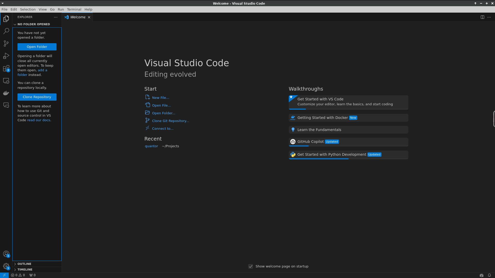
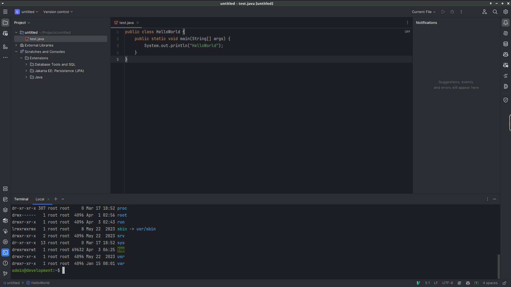
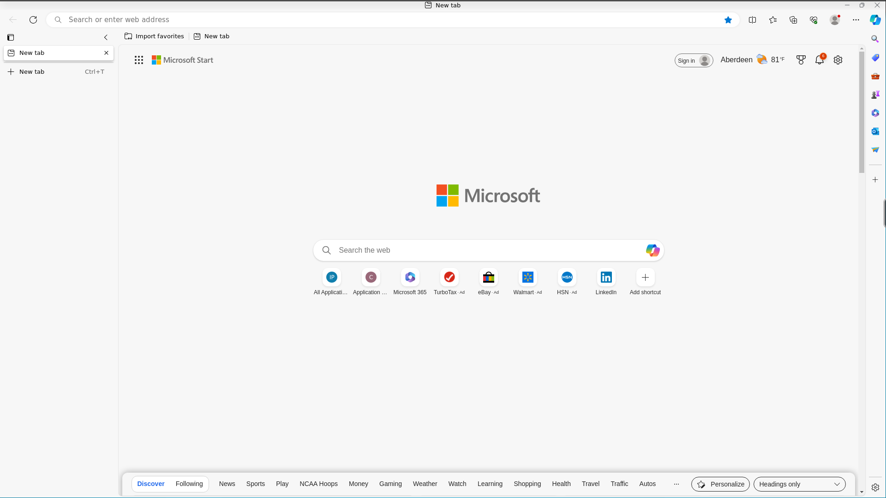
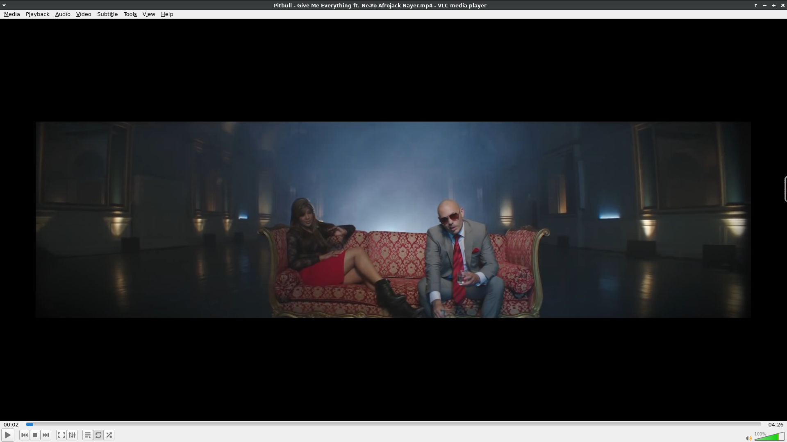
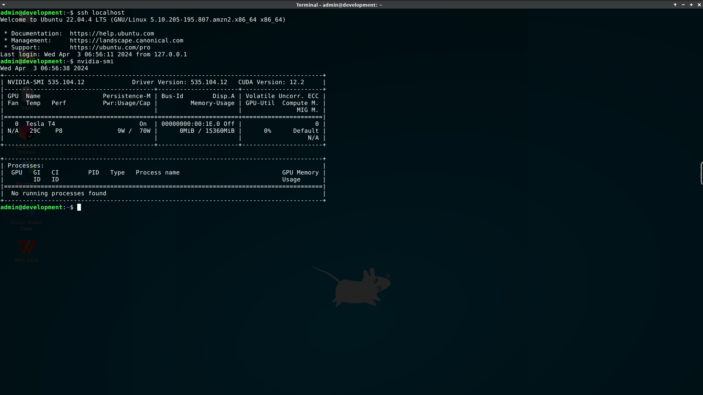
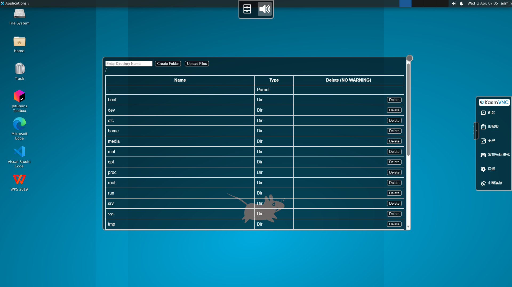

# Docker OS
## Introduction
The purpose of these images is to provide a full featured web native Linux desktop experience for any Linux application or desktop environment. 

These images contain the following services:

* [KasmVNC](https://www.kasmweb.com/kasmvnc) - The core technology for interacting with a containerized desktop from a web browser.
* [Kclient](https://github.com/linuxserver/kclient) - NodeJS Iframe wrapper for KasmVNC providing audio and file access.
* [PulseAudio](https://www.freedesktop.org/wiki/Software/PulseAudio/) - Sound subsystem used to capture audio from the active desktop session and send it to the browser via the Kclient helper application.
* [Nginx](https://www.nginx.com/) - Used to serve the mix of KasmVNC and Kclient with the appropriate headers and provide basic auth.
* [XFCE](https://xfce.org/) - Lightweight desktop environment that provides a full featured desktop experience.
* [OpenSSH](https://www.openssh.com/) - Used to provide secure shell access to the container.
* [Docker](https://www.docker.com/) - Can support running docker in docker(DinD) if the container is run in privileged mode.
* [Nvidia CUDA](https://www.nvidia.com/) - Can support running Nvidia CUDA applications if the Nvidia runtime is installed on the host.
* [Vscode](https://code.visualstudio.com/) - Code editor with support for many languages and extensions.
* [Jetbrains Toolbox](https://www.jetbrains.com/toolbox-app/) - Used to install and manage Jetbrains IDEs like IntelliJ IDEA, PyCharm, WebStorm, etc.
* [MS Edge](https://www.microsoft.com/en-us/edge) - Microsoft Edge browser(base Google Chrome) for web browsing.
* [VLC](https://www.videolan.org/vlc/index.html) - Media player that can be used to play audio and video files.

## User Guide
### Scenarios
Just open a browser and visit http://localhost:7900
(the address and port may be different depending on your settings).
#### 1. Have a Visual Desktop Environment in Docker Container


#### 2. Programming with Vscode in Docker Container


#### 3. Programming with Jetbrains IntelliJ Idea in Docker Container


#### 4. Browsing with MS Edge in Docker Container


#### 5. Playing Media with VLC in Docker Container


#### 6. SSH Access and Test CUDA in Docker Container


#### 7. Upload or Download Files via Browser in Docker Container


### Run Container From Docker Hub Images
#### 1. CPU Version with Desktop
```shell
sudo docker run -itd \
--privileged \
--hostname linux \
--shm-size 8g \
-e VNC_PORT=7900 \
-e VNC_USER=admin \
-e VNC_PASSWD=123456 \
-p 7900:7900 \
--name webos \
moonpath/webos:latest
```

#### 2. GPU Version with Desktop
```shell
sudo docker run -itd \
--runtime nvidia \
--gpus all \
--privileged \
--hostname linux \
--shm-size 8g \
-e VNC_PORT=7900 \
-e VNC_USER=admin \
-e VNC_PASSWD=123456 \
-p 7900:7900 \
--name webos-gpu \
moonpath/webos-gpu:latest
```

#### 3. CPU Version without Desktop
```shell
sudo docker run -itd \
--privileged \
--hostname linux \
-p 2222:22 \
--name devos \
moonpath/devos:latest
```

#### 4. GPU Version without Desktop
```shell
sudo docker run -itd \
--runtime nvidia \
--gpus all \
--privileged \
--hostname linux \
-p 2222:22 \
--name devos-gpu \
moonpath/devos-gpu:latest
```

### Build Docker Image and Run Container

#### 1. CPU Version with Desktop
```shell
# Clone repository
git clone https://github.com/moonpath/dockeros.git
cd dockeros

# Build Docker Image
sudo docker build -t webos:latest -f dockerfile-webos .

# Run Docker Container
sudo docker run -itd \
--runtime nvidia \
--gpus all \
--privileged \
--hostname linux \
--shm-size 8g \
-e VNC_PORT=7900 \
-e VNC_USER=admin \
-e VNC_PASSWD=123456 \
-p 7900:7900 \
--name webos \
webos:latest
```

#### 2. GPU Version with Desktop
```shell
# Clone repository
git clone https://github.com/moonpath/dockeros.git
cd dockeros

# Build Docker Image
sudo docker build -t webos-gpu:latest -f dockerfile-webos-gpu .

# Run Docker Container
sudo docker run -itd \
--runtime nvidia \
--gpus all \
--privileged \
--hostname linux \
--shm-size 8g \
-e VNC_PORT=7900 \
-e VNC_USER=admin \
-e VNC_PASSWD=123456 \
-p 7900:7900 \
--name webos-gpu \
webos-gpu:latest
```

#### 3. CPU Version without Desktop
```shell
# Clone repository
git clone https://github.com/moonpath/dockeros.git
cd dockeros

# Build Docker Image
sudo docker build -t devos:latest -f dockerfile-devos .

# Run Docker Container
sudo docker run -itd \
--runtime nvidia \
--gpus all \
--privileged \
--hostname linux \
-p 2222:22 \
--name devos \
devos:latest
```

#### 4. GPU Version without Desktop
```shell
# Clone repository
git clone https://github.com/moonpath/dockeros.git
cd dockeros

# Build Docker Image
sudo docker build -t devos-gpu:latest -f dockerfile-devos-gpu .

# Run Docker Container
sudo docker run -itd \
--runtime nvidia \
--gpus all \
--privileged \
--hostname linux \
-p 2222:22 \
--name devos-gpu \
devos-gpu:latest
```
